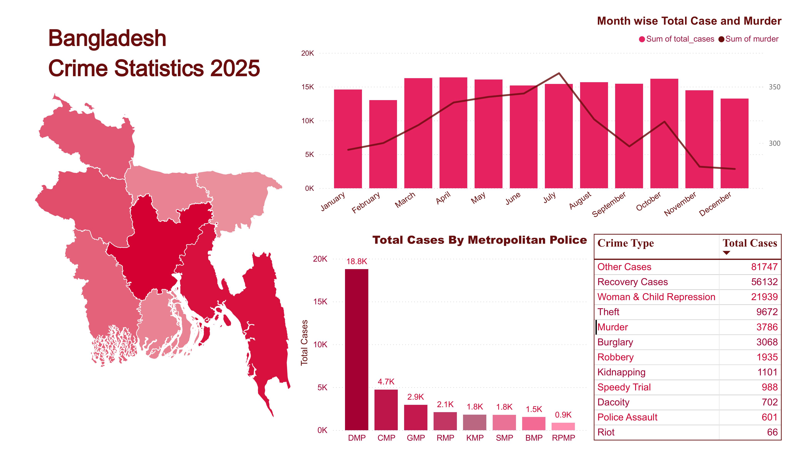

# Bangladesh Crime Statistics 2025

A comprehensive crime data analysis project covering police unit-wise monthly crime statistics across Bangladesh for 2025. Built with **MySQL** for data storage and analysis, and **Power BI** for interactive dashboards.

---
## Data Source: https://www.police.gov.bd/en/january_2020


## 📊 Dashboard Preview
> Power BI Dashboard showing crime distribution across Metropolitan Police units and monthly trends.


Key highlights from the dashboard:
- **DMP** (Dhaka Metropolitan Police) leads with **18.8K** total cases
- **Other Cases** is the most reported category with **81,747** incidents
- **Recovery Cases** follow with **56,132** cases
- **Woman & Child Repression** cases total **21,939**

---

## 📁 Project Structure

```
bangladesh-crime-stats-2025/
│
├── crime_statistics.sql       # Full SQL script (schema + queries)
├── crime_dashboard.pbix       # Power BI dashboard file
├── README.md                  # Project documentation
```

---

## 🗄️ Database Schema

```sql
CREATE DATABASE IF NOT EXISTS crime_statistics_2025;
USE crime_statistics_2025;

CREATE TABLE IF NOT EXISTS crime_data (
    id                      INT AUTO_INCREMENT PRIMARY KEY,
    month                   VARCHAR(20) NOT NULL,
    unit                    VARCHAR(50) NOT NULL,
    dacoity                 INT DEFAULT 0,
    robbery                 INT DEFAULT 0,
    murder                  INT DEFAULT 0,
    speedy_trial            INT DEFAULT 0,
    riot                    INT DEFAULT 0,
    woman_child_repression  INT DEFAULT 0,
    kidnapping              INT DEFAULT 0,
    police_assault          INT DEFAULT 0,
    burglary                INT DEFAULT 0,
    theft                   INT DEFAULT 0,
    other_cases             INT DEFAULT 0,
    recovery_cases          INT DEFAULT 0,
    total_cases             INT DEFAULT 0
);
```

---

## 🔍 SQL Analysis Queries

### 1. Total Monthly Summary (All Units)
```sql
SELECT 
    month,
    SUM(dacoity)                AS total_dacoity,
    SUM(robbery)                AS total_robbery,
    SUM(murder)                 AS total_murder,
    SUM(speedy_trial)           AS total_speedy_trial,
    SUM(riot)                   AS total_riot,
    SUM(woman_child_repression) AS total_woman_child_repression,
    SUM(kidnapping)             AS total_kidnapping,
    SUM(police_assault)         AS total_police_assault,
    SUM(burglary)               AS total_burglary,
    SUM(theft)                  AS total_theft,
    SUM(other_cases)            AS total_other_cases,
    SUM(recovery_cases)         AS total_recovery_cases,
    SUM(total_cases)            AS grand_total_cases
FROM crime_data
GROUP BY month;
```

### 2. Monthly Summary — Range Police Only
```sql
SELECT 
    month,
    SUM(dacoity)                AS total_dacoity,
    SUM(robbery)                AS total_robbery,
    SUM(murder)                 AS total_murder,
    SUM(speedy_trial)           AS total_speedy_trial,
    SUM(riot)                   AS total_riot,
    SUM(woman_child_repression) AS total_woman_child_repression,
    SUM(kidnapping)             AS total_kidnapping,
    SUM(police_assault)         AS total_police_assault,
    SUM(burglary)               AS total_burglary,
    SUM(theft)                  AS total_theft,
    SUM(other_cases)            AS total_other_cases,
    SUM(recovery_cases)         AS total_recovery_cases,
    SUM(total_cases)            AS grand_total_cases
FROM crime_data
WHERE unit LIKE '%Range'
GROUP BY month
ORDER BY grand_total_cases DESC;
```

### 3. Monthly Summary — Metropolitan Police (MP) Only
```sql
SELECT 
    month,
    SUM(dacoity)                AS total_dacoity,
    SUM(robbery)                AS total_robbery,
    SUM(murder)                 AS total_murder,
    SUM(speedy_trial)           AS total_speedy_trial,
    SUM(riot)                   AS total_riot,
    SUM(woman_child_repression) AS total_woman_child_repression,
    SUM(kidnapping)             AS total_kidnapping,
    SUM(police_assault)         AS total_police_assault,
    SUM(burglary)               AS total_burglary,
    SUM(theft)                  AS total_theft,
    SUM(other_cases)            AS total_other_cases,
    SUM(recovery_cases)         AS total_recovery_cases,
    SUM(total_cases)            AS grand_total_cases
FROM crime_data
WHERE unit LIKE '%MP'
GROUP BY month
ORDER BY grand_total_cases DESC;
```

### 4. Total Summary by Unit
```sql
SELECT 
    unit,
    SUM(dacoity)                AS total_dacoity,
    SUM(robbery)                AS total_robbery,
    SUM(murder)                 AS total_murder,
    SUM(speedy_trial)           AS total_speedy_trial,
    SUM(riot)                   AS total_riot,
    SUM(woman_child_repression) AS total_woman_child_repression,
    SUM(kidnapping)             AS total_kidnapping,
    SUM(police_assault)         AS total_police_assault,
    SUM(burglary)               AS total_burglary,
    SUM(theft)                  AS total_theft,
    SUM(other_cases)            AS total_other_cases,
    SUM(recovery_cases)         AS total_recovery_cases,
    SUM(total_cases)            AS grand_total_cases
FROM crime_data
GROUP BY unit
ORDER BY grand_total_cases DESC;
```

### 5. Most Common Crime Types (Ranked)
```sql
SELECT 'Dacoity'                  AS crime_type, SUM(dacoity)                AS total FROM crime_data UNION ALL
SELECT 'Robbery',                                SUM(robbery)                         FROM crime_data UNION ALL
SELECT 'Murder',                                 SUM(murder)                          FROM crime_data UNION ALL
SELECT 'Speedy Trial',                           SUM(speedy_trial)                    FROM crime_data UNION ALL
SELECT 'Riot',                                   SUM(riot)                            FROM crime_data UNION ALL
SELECT 'Woman & Child Repression',               SUM(woman_child_repression)          FROM crime_data UNION ALL
SELECT 'Kidnapping',                             SUM(kidnapping)                      FROM crime_data UNION ALL
SELECT 'Police Assault',                         SUM(police_assault)                  FROM crime_data UNION ALL
SELECT 'Burglary',                               SUM(burglary)                        FROM crime_data UNION ALL
SELECT 'Theft',                                  SUM(theft)                           FROM crime_data UNION ALL
SELECT 'Other Cases',                            SUM(other_cases)                     FROM crime_data UNION ALL
SELECT 'Recovery Cases',                         SUM(recovery_cases)                  FROM crime_data
ORDER BY total DESC;
```

---

## 📅 Monthly Crime Trends

### 6. Top 5 Months by Murder Count
```sql
SELECT 
    month,
    SUM(murder)          AS total_murder,
    ROUND(AVG(murder), 2) AS avg_monthly_murder,
    MAX(murder)          AS peak_monthly_murder
FROM crime_data
GROUP BY month
ORDER BY total_murder DESC
LIMIT 5;
```

### 7. Top 5 Months by Robbery
```sql
SELECT 
    month,
    SUM(robbery)          AS total_robberies,
    ROUND(AVG(robbery), 2) AS avg_monthly_robberies,
    MAX(robbery)          AS peak_monthly_robberies
FROM crime_data
GROUP BY month
ORDER BY total_robberies DESC
LIMIT 5;
```

### 8. Top 5 Months by Dacoity
```sql
SELECT 
    month,
    SUM(dacoity)          AS total_dacoity,
    ROUND(AVG(dacoity), 2) AS avg_monthly_dacoity,
    MAX(dacoity)          AS peak_monthly_dacoity
FROM crime_data
GROUP BY month
ORDER BY total_dacoity DESC
LIMIT 5;
```

---

## 🏙️ Unit-Level Crime Analysis

### 9. Top 5 Units — Theft
```sql
SELECT 
    unit,
    SUM(theft)          AS total_theft,
    ROUND(AVG(theft), 2) AS avg_monthly_theft,
    MAX(theft)          AS peak_monthly_theft
FROM crime_data
GROUP BY unit
ORDER BY total_theft DESC
LIMIT 5;
```

### 10. Top 5 Units — Burglary
```sql
SELECT 
    unit,
    SUM(burglary)          AS total_burglary,
    ROUND(AVG(burglary), 2) AS avg_monthly_burglary,
    MAX(burglary)          AS peak_monthly_burglary
FROM crime_data
GROUP BY unit
ORDER BY total_burglary DESC
LIMIT 5;
```

### 11. Top 5 Units — Woman & Child Repression
```sql
SELECT 
    unit,
    SUM(woman_child_repression)          AS total_cases,
    ROUND(AVG(woman_child_repression), 2) AS avg_monthly_cases,
    MAX(woman_child_repression)          AS peak_monthly_cases
FROM crime_data
GROUP BY unit
ORDER BY total_cases DESC
LIMIT 5;
```

### 12. Top 5 Units — Kidnapping
```sql
SELECT 
    unit,
    SUM(kidnapping)          AS total_kidnapping,
    ROUND(AVG(kidnapping), 2) AS avg_monthly_kidnapping,
    MAX(kidnapping)          AS peak_monthly_kidnapping
FROM crime_data
GROUP BY unit
ORDER BY total_kidnapping DESC
LIMIT 5;
```

### 13. Top 5 Units — Police Assault
```sql
SELECT 
    unit,
    SUM(police_assault)          AS total_assaults,
    ROUND(AVG(police_assault), 2) AS avg_monthly_assaults,
    MAX(police_assault)          AS peak_monthly_assaults
FROM crime_data
GROUP BY unit
ORDER BY total_assaults DESC
LIMIT 5;
```

### 14. Top 5 Units — Riot
```sql
SELECT 
    unit,
    SUM(riot)          AS total_riots,
    ROUND(AVG(riot), 2) AS avg_monthly_riots,
    MAX(riot)          AS peak_monthly_riots
FROM crime_data
GROUP BY unit
ORDER BY total_riots DESC
LIMIT 5;
```

### 15. Top 5 Units — Speedy Trial
```sql
SELECT 
    unit,
    SUM(speedy_trial)          AS total_speedy_trials,
    ROUND(AVG(speedy_trial), 2) AS avg_monthly_speedy_trials,
    MAX(speedy_trial)          AS peak_monthly_speedy_trials
FROM crime_data
GROUP BY unit
ORDER BY total_speedy_trials DESC
LIMIT 5;
```

### 16. Top 5 Units — Murder
```sql
SELECT 
    unit,
    SUM(murder)          AS total_murders,
    ROUND(AVG(murder), 2) AS avg_monthly_murders,
    MAX(murder)          AS peak_monthly_murders
FROM crime_data
GROUP BY unit
ORDER BY total_murders DESC
LIMIT 5;
```

### 17. Top 5 Units — Robbery
```sql
SELECT 
    unit,
    SUM(robbery)          AS total_robberies,
    ROUND(AVG(robbery), 2) AS avg_monthly_robberies,
    MAX(robbery)          AS peak_monthly_robberies
FROM crime_data
GROUP BY unit
ORDER BY total_robberies DESC
LIMIT 5;
```

### 18. Top 5 Units — Dacoity
```sql
SELECT 
    unit,
    SUM(dacoity)          AS total_dacoity,
    ROUND(AVG(dacoity), 2) AS avg_monthly_dacoity,
    MAX(dacoity)          AS peak_monthly_dacoity
FROM crime_data
GROUP BY unit
ORDER BY total_dacoity DESC
LIMIT 5;
```

---

## 🔎 Key Insights Queries

### 26. Top 3 Most Dangerous Months (by Murder)
```sql
SELECT 
    month,
    SUM(murder) AS total_murder
FROM crime_data
GROUP BY month
ORDER BY total_murder DESC
LIMIT 3;
```

### 27. Overall Murder Statistics (2025)
```sql
SELECT 
    COUNT(DISTINCT month)               AS months,
    COUNT(DISTINCT unit)                AS units,
    SUM(murder)                         AS total_murder_2025,
    ROUND(SUM(murder) / COUNT(DISTINCT month), 2) AS avg_murder_per_month,
    ROUND(SUM(murder) / 365, 2)         AS avg_murder_per_day
FROM crime_data;
```

### 28. Top 3 Most Dangerous Units (Overall)
```sql
SELECT 
    unit,
    SUM(total_cases) AS total_cases
FROM crime_data
GROUP BY unit
ORDER BY total_cases DESC
LIMIT 3;
```

### 29. Month-over-Month Crime Growth Rate
```sql
SELECT 
    month,
    SUM(total_cases) AS total_cases,
    ROUND(
        (SUM(total_cases) - LAG(SUM(total_cases)) OVER ())
        / LAG(SUM(total_cases)) OVER ()
        * 100,
    2) AS crime_growth_rate_pct
FROM crime_data
GROUP BY month;
```

---

## 📈 Crime Type Summary (from Dashboard)

| Crime Type | Total Cases |
|---|---|
| Other Cases | 81,747 |
| Recovery Cases | 56,132 |
| Woman & Child Repression | 21,939 |
| Theft | 9,672 |
| Murder | 3,786 |
| Burglary | 3,068 |
| Robbery | 1,935 |
| Kidnapping | 1,101 |
| Speedy Trial | 988 |
| Dacoity | 702 |
| Police Assault | 601 |
| Riot | 66 |

---

## 🏛️ Metropolitan Police Units

| Unit | Full Name | Total Cases | Notes |
|---|---|---|---|
| DMP | Dhaka Metropolitan Police | 18,800 | Largest unit; covers capital — expected to dominate |
| CMP | Chattogram Metropolitan Police | 4,700 | Port city; second busiest |
| GMP | Gazipur Metropolitan Police | 2,900 | Industrial zone; rapidly urbanizing |
| RMP | Rajshahi Metropolitan Police | 2,100 | Northwestern divisional hub |
| KMP | Khulna Metropolitan Police | 1,800 | Southwestern delta region |
| SMP | Sylhet Metropolitan Police | 1,800 | Northeastern; near Indian border |
| BMP | Barishal Metropolitan Police | 1,500 | River delta; southern coastal area |
| RPMP | Rangpur Metropolitan Police | 900 | Northernmost metro unit; lowest caseload |


