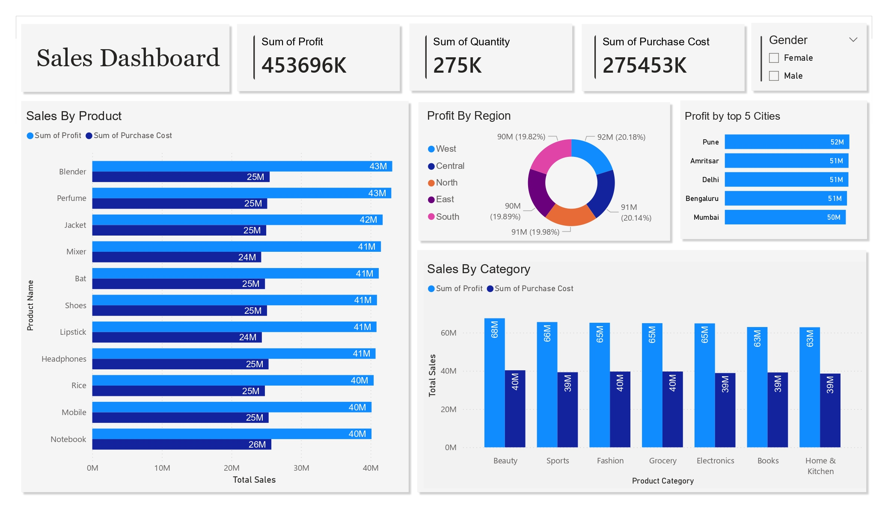

# 📊 Sales Analytics Dashboard (Power BI)

This repository contains my **first end-to-end Sales Analytics Dashboard**, built to analyze sales performance across **products, categories, regions, cities, and customer gender**.

The goal of this project is to transform raw sales data into **actionable business insights** using clear KPIs and interactive visualizations.

---

## 🚀 Project Overview

The dashboard helps answer key business questions such as:

- Which products and categories generate the highest profit?
- How does profit vary across regions and cities?
- What are the purchasing patterns by gender?
- Which cities contribute most to total profit?

---
## 📂 Repository Structure

'''
├── images/
│ ├── sales_all.jpg
│ ├── sales_female.jpg
│ ├── sales_male.jpg
│
└── README.md
'''
---
## 📈 Dashboard Preview

### 🔹 Overall Sales Dashboard

---

### 🔹 Female Customers Sales Dashboard

---

### 🔹 Male Customers Sales Dashboard

---

## 🧩 Key Features

- **Interactive KPI Cards**
  - Total Profit
  - Total Quantity Sold
  - Total Purchase Cost

- **Sales by Product**
  - Profit vs Purchase Cost comparison
  - Highlights high-performing products

- **Sales by Category**
  - Category-level performance analysis

- **Profit by Region**
  - Regional contribution to overall profit

- **Top 5 Cities by Profit**
  - Identifies the most profitable cities

- **Gender-Based Analysis**
  - Insights for Male, Female, and All customers

---

## 🛠 Tools & Technologies

- **Power BI**
- **DAX (Basic Measures)**
- **Data Modeling**
- **Business Intelligence & Data Visualization**

---

